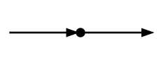
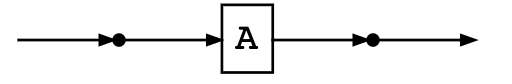
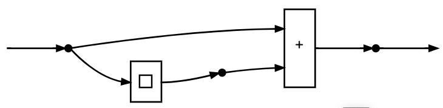
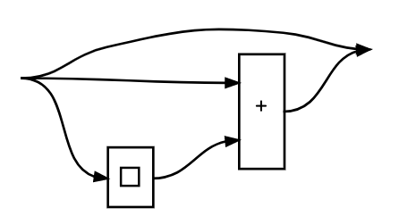

# Graphical Linear Algebra and E-graphs

This repo extends Catlab.jl with more theories, including graphical linear algebra. Because the optimization of linear algebra computations is a critical engineering task, this repo is also used for developing an e-graphs approach to term optimization (which is applicable to all term rewriting systems, not just linear algebra terms).

These links provide more background on [GLA](https://graphicallinearalgebra.net/) and [e-graphs](https://docs.rs/egg/0.6.0/egg/tutorials/_01_background/index.html).

## Examples

We represent terms of linear algebra as wiring diagrams. Imagine vectors living on wires.

```julia
x_vec = @program C_gla (x::X) (x,)
```


Multiplication by the matrix `A` looks like this:
```julia
a_times_x = @program C_gla (x::X) A(x)
```



We also have negation and addition, which look like this:
```julia
x_plus_neg_x = @program C_gla (x::X) ⁺(x, □(x))
```




Connected wires (via a black junction or a port of a box) share the same value. So one could assert the fact that adding zero to a vector does nothing to it by connecting the input to the addition and its output.

```julia
x_plus_neg_x_eq = @program C_gla (x::X) [x,⁺(x, □(x))]
```




By doing this, we added a fact to the things we can learn from the term, but we did not have to throw any information away (contrast this with traditional term rewriting, where replacing `(x+0)` with `x` in some sense throws away the fact that `x == (x+0)`). This is a hallmark of the e-graph approach.

How do e-graphs allow us to optimize terms of some theory, such as Graphical Linear Algebra? See the example in this blog post.

