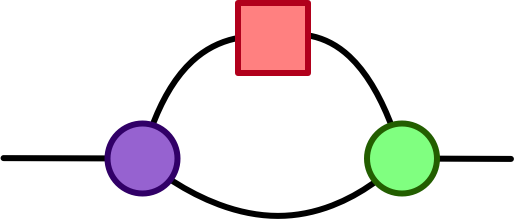

#   GraphicalLinearAlgebra.jl

This repo extends [Catlab.jl](https://github.com/AlgebraicJulia/Catlab.jl) with more theories, including graphical linear algebra.

Future work will incorporate knowledge from [String Diagram Rewrite Theory](https://arxiv.org/abs/2012.01847), and we will perform optimization of linear algebra computations with an e-graphs approach (which is applicable to theories beyond GLA).

These links provide more background on [GLA](https://graphicallinearalgebra.net/) and [e-graphs](https://docs.rs/egg/0.6.0/egg/tutorials/_01_background/index.html).